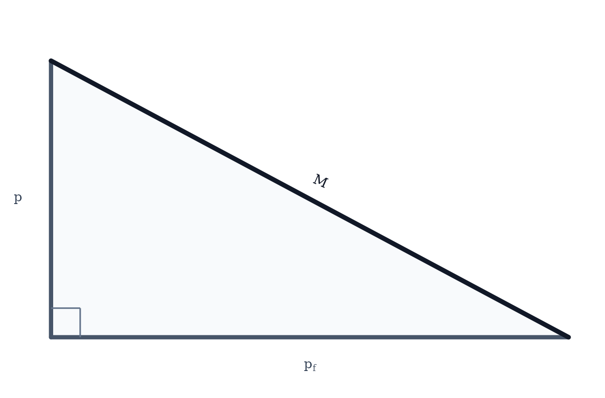

# Core Terms and Variables

M1 begins by fixing a small momentum-first vocabulary. Before introducing directional conservation, the opening framework needs three quantities:
- the quantity associated with rest mass,
- the quantity associated with translation,
- and the total momentum content built from both.

These are $p_f$, $p$, and $M$.

## Fermic momentum

The first primitive is **fermic momentum**, written $p_f$.
At the inertial baseline,
$$
p_f = m_0 c,
$$
where $m_0$ is the particle's rest mass and $c$ is the speed of light.

This is the quantity M1 associates with mass. In M1, mass is treated not as an independent primitive, but as momentum locked into an internal particle cycle. The structure of that cycle is associated with the particle's identity.

## Bosic momentum

The second primitive is **bosic momentum**, written $p$.
This is the momentum associated with translation. In the opening framework, it is the part of a particle's momentum content that carries directed motion and change of position in space.

As a magnitude, $p$ is scalar. Its direction is carried by the vector $\vec p$ and by the directional components $p_k$.

So the notation is:
- $p$ = bosic momentum magnitude,
- $p_k$ = directional components,
- $\vec p$ = the corresponding momentum vector.

## Core momentum

The third primitive quantity is **core momentum**, written $M$.
A particle carries both fermic momentum and bosic momentum. In the inertial baseline, these are treated as orthogonal contributions, and their total momentum content is
$$
M = \sqrt{p_f^2 + p^2}.
$$

A sharp eye will notice that this is relativistic energy in flat space, that is,
$$
E = cM.
$$

## The momentum triangle

The relation
$$
M = \sqrt{p_f^2 + p^2}
$$
is the framework's **momentum triangle**. It states that, in the inertial baseline, fermic momentum and bosic momentum combine into a single total momentum content. @fig-momentum-triangle shows this inertial composition in its simplest form.

{#fig-momentum-triangle fig-align="center" out-width="62%"}

At this stage, this is simply the inertial composition relation. The next section introduces the deeper directional-positive conservation postulate and the present split used to realize it.

## Terminology note

The terms **fermic** and **bosic** are adapted from the familiar distinction between **fermionic** and **bosonic** structure. In this book, however, **fermic** and **bosic** are used specifically for momentum quantities or momentum roles, while **fermionic** and **bosonic** are reserved for structure, geometry, winding, chirality, or state labels. The terminology is meant to mark a distinction in usage, not to assume from the outset a one-to-one identification with the standard fermion/boson classification of quantum field theory.
