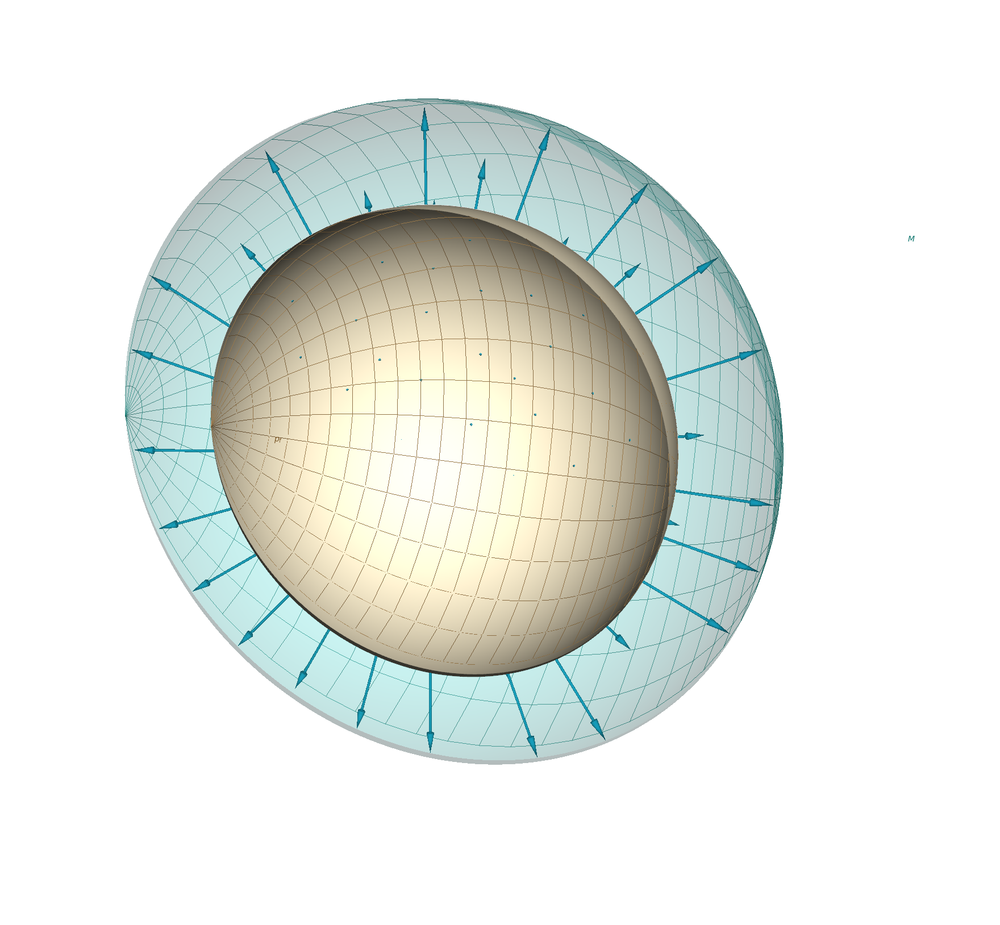
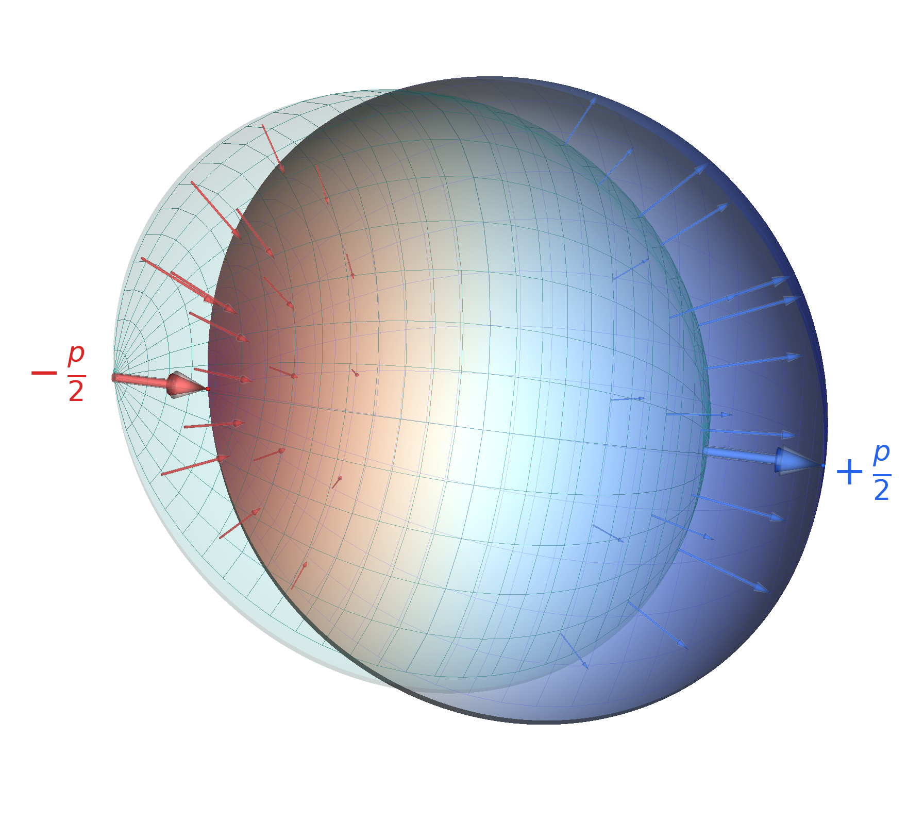

# Additive Directional Momentum Conservation (ADMC)

Momentum conservation lies at the core of M1. Its foundational postulate is the following.

**For any isolated system and any chosen direction (k), momentum is conserved directionally as a sum of positive quantities.**

We coin this principle **Additive Diretional Momentum Concervation**, or ADMC for short. **Directional** means that the conservation statement is made relative to an arbitrary chosen unit vector. **Additive** means that the conserved quantity is composed of a set of positive quantities, one per particle.

For a chosen direction $k$ in a system, every particle contributes two positive quantities associated with the forwards and backwards directions, respectively. The conservation law is then

$$
\sum_i p_{k^+}^{(i)} = \text{constant},
\qquad
\sum_i p_{k^-}^{(i)} = \text{constant},
$$

for every chosen direction $k$.

The familiar separation into total momentum content and signed directional momentum is therefore not assumed at the start. It is recovered from this deeper directional-positive structure.

In its present M1 form, the two realized directional quantities are

$$
p_{k^+} = M + \tfrac{1}{2}p_k,
\qquad
p_{k^-} = M - \tfrac{1}{2}p_k.
$$

Here $p_k$ is the component of the bosic momentum vector along the chosen direction, while $M$ is the core momentum magnitude introduced in the previous section. The labels $k^+$ and $k^-$ denote the two positive directional quantities associated with the two senses of that direction.

@fig-foundations-shells-admc gives a schematic two-stage depiction of the momentum configuration associated with motion. For exposition, the configuration is shown first as an isotropic swelling from $p_f$ to $M$, and then as a directional deformation of the swollen shell. The stages are representational rather than sequential: physically they belong to one combined momentum configuration.

::: {#fig-foundations-shells-admc layout-ncol=2}

{#fig-foundations-shells-admc-a}

{#fig-foundations-shells-admc-b}

A schematic two-stage depiction of the momentum configuration associated with motion. Panel (a) represents an isotropic swelling from $p_f$ to $M$. Panel (b) represents a directional deformation of the swollen shell. The stages are representational rather than sequential: physically they belong to one combined momentum configuration.
:::

This is the fixed working form used throughout the book. As shown in the derivation appendix on the structural uniqueness of the directional-positive split, this realized split is not arbitrary: within the natural additive, symmetry-compatible, axis-wise class of two-channel encodings, canonical normalization uniquely fixes the realized form

$$
p_{k^+} = M + \tfrac{1}{2}p_k,
\qquad
p_{k^-} = M - \tfrac{1}{2}p_k.
$$

Its inverse relations are

$$
M = \tfrac{1}{2}(p_{k^+}+p_{k^-}),
\qquad
p_k = p_{k^+}-p_{k^-}.
$$

These inverse relations show that the directional-positive formulation remains exactly connected to the familiar $(M, p_k)$ language. The next section makes that connection explicit and shows how the ordinary conservation of total $M$ and directional momentum components emerges as recovered structure within this deeper hierarchy.
