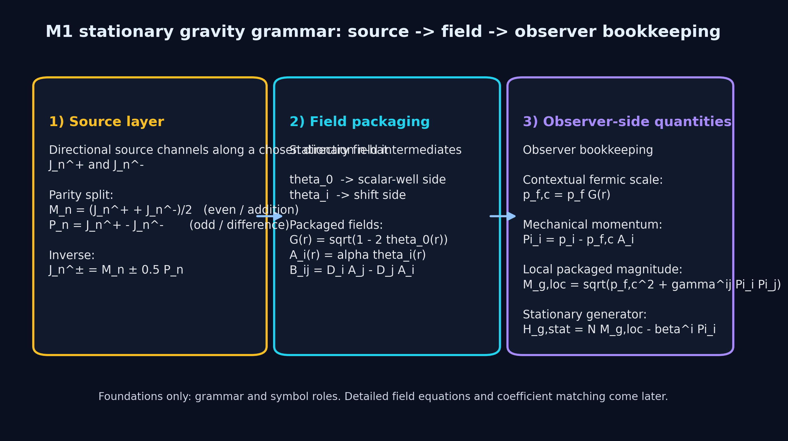

## Minimal Gravity Grammar

The previous subsection introduced kinematic modifiers as the framework's language for structured departures from the inertial baseline.
This subsection applies that language to gravity, but only at the level of **minimal grammar**.

That limitation matters.
The goal here is not to complete the gravity program. It is to make clear what quantities later gravity correspondence chapters will talk about, how they are related, and what role each one is supposed to play.

## The pipeline

The canonical gravity pipeline in M1 is:

`directional sources -> stationary field -> observer bookkeeping`

or, in more explicit symbolic form,

`(\mathcal J_k^\pm) -> (\mathcal G, \mathcal A_i, \mathcal B_{ij}) -> (p_{f,c}, \Pi_i, M_{g,loc}, H_{g,stat})`

This pipeline is one of the current backbone locks of the framework.
It is the grammar by which source information is turned into local field quantities and then into observer-side packaged kinematics.

{#fig-source-field-observer fig-align="center"}

## Source-side parity split

The source-side variables begin from directional source densities `\mathcal J_k^\pm`.
These are split into even and odd combinations:

$$
 \mathcal M_k = \frac{\mathcal J_k^+ + \mathcal J_k^-}{2},
 \qquad
 \mathcal P_k = \mathcal J_k^+ - \mathcal J_k^-.
$$

The inverse relation is

$$
 \mathcal J_k^\pm = \mathcal M_k \pm \tfrac{1}{2} \mathcal P_k.
$$

This parity split matters because it gives the gravity program its first structural organization.
In the current reading,
- the **even** channel feeds the scalar-well side of the field,
- the **odd** channel feeds the shift/rotation side.

At this stage that is a grammar and correspondence principle, not yet a full field derivation.
But it is the right place to begin because it keeps the later field packaging from looking arbitrary.

## Field-side packaging

The field intermediates are written `\theta_0` and `\theta_i`.
From these, the framework packages the stationary field in three pieces.

### Scalar well

The scalar well field is written
$$
 \mathcal G(r) = \sqrt{1 - 2\theta_0(r)}.
$$
This is the quantity later aligned with the lapse-like sector in the stationary GR dictionary.

### Shift potential

The shift potential is written
$$
 \mathcal A_i(r) = \alpha \, \theta_i(r),
$$
where `\alpha` is a normalization factor fixed only at the level needed for correspondence.
The role of `\mathcal A_i` is to carry the shift or rotational side of the stationary field grammar.

### Flux tensor

From the shift potential one defines the antisymmetric flux tensor
$$
 \mathcal B_{ij} = D_i \mathcal A_j - D_j \mathcal A_i.
$$
This is the natural stationary rotation / vorticity-like packaged object on the field side.

## Observer-side bookkeeping

The next stage of the pipeline is observer bookkeeping.
The point here is not to say that the observer creates the physics. The point is to distinguish the stationary field itself from the way local kinematic quantities are packaged for trajectories, clocks, and transport.

### Contextual fermic scale

The first quantity is the contextualized fermic scale,
$$
 p_{f,c} = p_f \mathcal G.
$$
This is the canonical KM-A1 prototype in gravity language.
The intrinsic fermic scale is not abandoned; it is dressed by the scalar well.
That is why gravity in the current M1 program is closely tied to local fermic contextualization.

### Mechanical momentum

The next quantity is the mechanical momentum,
$$
 \Pi_i = p_i - p_{f,c} \mathcal A_i.
$$
This packages the directional/shift coupling in the observer-side kinematics.
It is the natural place where KM-A2-type structure begins to appear.

### Local packaged magnitude

From these one defines the local packaged magnitude
$$
 M_{g,loc} = \sqrt{p_{f,c}^2 + \gamma^{ij} \Pi_i \Pi_j}.
$$
This is a local quantity. It is not, by itself, the globally conserved stationary transport generator.
That distinction must be kept explicit.

### Stationary transport generator

The stationary conserved transport generator is written
$$
 H_{g,stat} = N M_{g,loc} - \beta^i \Pi_i.
$$
This is the quantity aligned with the GR-side stationary Hamiltonian form in the current correspondence language.

The terminology lock here matters.
Older notes sometimes overload `M_g` for both the local packaged magnitude and the stationary generator. This book should not do that.
If shorthand is ever used, it should be made explicit that `M_g` means `M_{g,loc}` only, not `H_{g,stat}`.

## Why this belongs in Foundations

This grammar belongs in Foundations because later chapters on gravity, time dilation, and stationary correspondence depend on it.
Without it, the downstream gravity chapter would have to introduce a new alphabet in the middle of an already technical argument.
With it, the reader can meet the formal correspondence program later without first having to decode the notation.

But this subsection must remain bounded.
It should not try to close the entire stationary gravity program inside Foundations. That would overload the opening section and blur the line between grammar and correspondence.

## What is established here, and what is deferred

This subsection establishes:
- the source / field / observer pipeline,
- the even/odd parity split,
- the packaged stationary field quantities,
- the distinction between local packaged magnitude and stationary generator,
- and the basic connection to KM-A language.

It does **not** yet establish:
- the full stationary field equations,
- coefficient matching to GR in detail,
- strong-field closure,
- or the complete transport dynamics.

Those belong to the later gravity chapter.

## Open question carried forward

One substantial chapter-design question remains open: whether Part II should include a compact one-block stationary equation skeleton immediately after this grammar, or whether even that should be deferred entirely to the Part IV gravity chapter.

That question affects pacing and chapter weight, but it does not block the present subsection. The grammar itself is now clear enough to stand.

## What this subsection establishes

M1 now has a foundational gravity vocabulary:
- directional sources,
- parity-split source channels,
- stationary field packaging,
- contextual fermic scale,
- mechanical momentum,
- local packaged magnitude,
- stationary transport generator.

This is enough grammar for the rest of the book to speak clearly about gravity before the full gravity correspondence program is developed.
