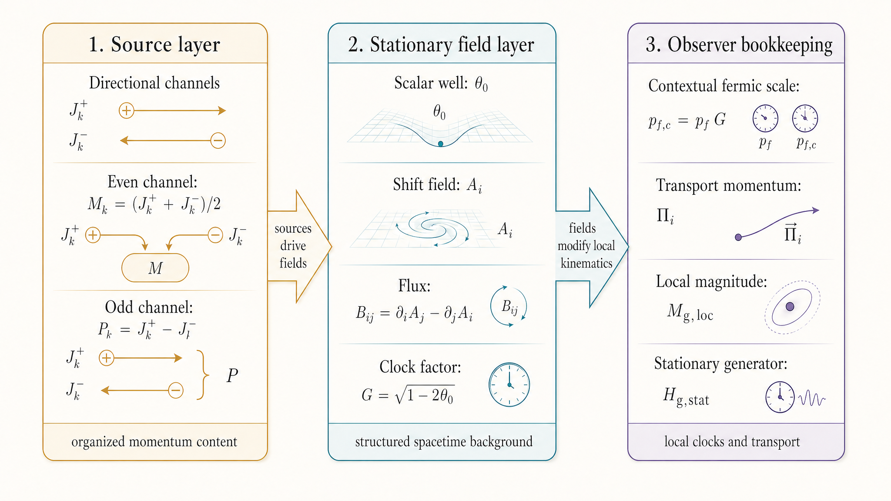

# Gravity in M1

Gravity is the first place where the inertial shell stops being enough.

As long as momentum is discussed only in its inertial setting, the framework can speak about conserved quantities, directional splits, clocks, and kinematic modifiers without yet forcing the stage itself to do much. Gravity changes that. Once sufficiently organized momentum content deforms the stage on which particles move, space can no longer be treated as merely available. It must be treated as structured.

That is why gravity is the first real test of structured spacetime in M1. The framework now has to show that momentum-first language can describe not only motion through a stage, but also deformation of the stage and the consequences of that deformation for particles and observers.

## The M1 gravity picture in one sentence

The basic picture is simple.

Momentum distorts space, that distortion propagates, and the resulting structure modifies particle kinematics.

This sentence contains the whole conceptual spine of Part III.

The source side tells us what momentum content is present and how it is directionally organized. The field side tells us how that content deforms the stage. The observer side tells us how particles and clocks read the deformed stage locally. In a stationary regime the distortion settles into a stable background. In a nonstationary regime the distortion propagates and rearranges itself in time. In both cases the physical point is the same: gravity is not merely a force added to otherwise complete inertial motion. It is a structured modification of the setting in which motion and clocking occur.

{#fig-gravity-directional-source-field-observer fig-align="center" width="100%"}

@fig-gravity-directional-source-field-observer shows the physical version of the grammar before the variables are introduced. The source is not an abstract mass point, but organized momentum content. The field is not a separate substance added afterward, but the structured distortion carried by the surrounding stage. The observer is not outside the story; local clocks and paths are read through that background.

## What gravity changes for particles and observers

The most immediate payoff of this picture appears at the observer side.

A gravitational background changes how local physical evolution is read. The local fermic scale is no longer read in isolation, but through a contextual dressing that reflects the surrounding field. Transport is no longer described only by bare momentum variables, but by momentum read against a structured background that can include both a scalar well and a directional shift. Local packaged magnitudes need to be distinguished from asymptotic comparison standards, because what a particle experiences where it is need not be identical to how the same process is described from far away.

This is why gravity in M1 is most naturally read as modified kinematics rather than as a purely added interaction term. The field changes the local clock scale, changes the locally relevant transport bookkeeping, and changes how motion should be measured. The later observer chapter will make those claims precise, but the physical meaning should already be visible here: gravity changes the way particles move and the way clocks run because it changes the structure of the stage they inhabit.

That observer-facing consequence is also what keeps the chapter grounded. The gravity program is not being developed only to introduce more field variables. It is being developed because those variables eventually explain why local transport, local clocking, and local comparison standards differ from their inertial forms.

## Gravity-side terms and variables

Before the later chapters can build the source, field, and observer machinery in detail, the main gravity-side vocabulary needs to be stated cleanly.

### Source-side variables

The source layer begins with the directional channels $J_k^+$ and $J_k^-$. These are the gravity-relevant directional source variables along a chosen direction $k$.

From them one forms the two combinations

$$
M_k = \frac{J_k^+ + J_k^-}{2},
\qquad
P_k = J_k^+ - J_k^-.
$$

The quantity $M_k$ is the even or additive channel. It captures the part of the source that feeds the scalar-well side of gravity. The quantity $P_k$ is the odd or directional channel. It captures the imbalance that feeds the shift or frame-drag side of gravity.

These variables therefore already tell us that the source is structured. Gravity does not begin from one undifferentiated source quantity and only later become more complicated. Its two main field roles are already visible in the parity structure of the source.

### Field-side variables

At the field layer, the central variables are $\theta_0$, $A_i$, and, where needed, the spatial metric sector $\gamma_{ij}$.

The quantity $\theta_0$ is the scalar well variable. It tracks the depth-like part of the gravitational background. The quantity $A_i$ is the shift field. It tracks the directional or rotational part of the background. A useful packaged scalar quantity built from $\theta_0$ is

$$
G = \sqrt{1 - 2\theta_0},
$$

which functions as the local gravitational clock factor in the stationary grammar.

The shift sector also carries a flux or rotation structure that may be written as

$$
B_{ij} = \partial_i A_j - \partial_j A_i.
$$

At this stage, the important point is not formal detail but job description. The scalar field tells us about the well. The shift field tells us about directional structure and frame-drag-like effects. Together they form the main achieved field grammar of Part III.

### Observer-side variables

At the observer side, the central quantities are $p_{f,c}$, $\Pi_i$, $M_{g,loc}$, and $H_{g,stat}$.

The quantity $p_{f,c}$ is the context-dressed fermic scale. It tells us how the local background modifies the clock-carrying sector. The quantity $\Pi_i$ is the local transport momentum read against the background. The quantity $M_{g,loc}$ is a local packaged gravitational magnitude. The quantity $H_{g,stat}$ is the stationary transport generator.

These should not be treated as interchangeable. Some are local readout quantities. Some are transport quantities. Some summarize local contextualized magnitude. Some generate stationary motion. Later chapters will use them carefully, but the basic distinction should already be clear: the observer side is where gravitational structure becomes kinematic consequence.

## The gravity grammar: source -> field -> observer

With the vocabulary in place, the whole gravity program can be summarized by one layered grammar:

$$
(J_k^\pm) \to (M_k, P_k) \to (\theta_0, A_i, \gamma_{ij}) \to (G, p_{f,c}, \Pi_i, M_{g,loc}).
$$

This grammar is not an arbitrary chapter outline. It is the natural consequence of the physical picture just introduced.

The source layer states what momentum content is present and how that content is parity-packaged. The field layer states how that source content deforms the stage. The observer layer states how the resulting background modifies local kinematics.

That separation is essential. The source is not the field. The field is not the observer readout. If those layers are collapsed together, gravity becomes hard to understand and even harder to test. If they are kept distinct, the part gains a clear explanatory order.

{#fig-stationary-gravity-grammar fig-align="center" width="100%"}

@fig-stationary-gravity-grammar gives the formal version of the same staged idea. Sources are packaged first. Field structure is built from them. Local kinematic consequences are then read from that field. The diagram is deliberately compact: it names the variables the reader needs to carry into the next chapters without turning the opening chapter into a derivation.

The next chapters unfold this grammar in order. Chapter 11 develops the source layer. Chapter 12 builds the stationary field package. Chapter 13 shows how that field is read locally. Only after the stationary backbone is clear does Chapter 14 open the nonstationary extension track.

## Scope, regime, and what Part III will establish

The gravity program begins in a stationary-first regime. That choice is both physical and methodological.

It is physical because the current stationary package is already the strongest achieved part of the gravity program. The scalar-well plus shift grammar is stable, the Newtonian limit is clean, the weak and moderate stationary dictionary is readable, and Kerr can be treated as an exact stationary target in current M1 language.

It is methodological because stationarity gives the reader the clearest first pass. It lets the source, field, and observer layers be built in a settled regime before time-dependent propagation, promoted nonlinear closure, or tensor and radiative structure are added.

That does not mean that nonstationary gravity is absent from Part III. It means that nonstationary gravity should grow out of the achieved stationary backbone rather than replace it as the opening frame. The part therefore aims to establish two things with different weights: a mainline achieved stationary package, and a bounded nonstationary extension track that is now real enough to state clearly.

The chapter should also place one final boundary around the part's claims. Part III does not claim full final gravity completion in every regime. Its strongest results are stationary, and some of its most important successes are still best described as correspondence or overlap results rather than completed native derivations. That is not a weakness to hide. It is part of the framework's present scientific discipline.

What the reader should carry forward is straightforward. Gravity in M1 is the structured distortion of the stage by organized momentum content. That distortion is carried by a layered source, field, and observer grammar. It alters clocking and transport by modifying local kinematics. And the first task is to understand that grammar in its cleanest achieved regime before asking how far beyond it the current theory can already go.

The next step is therefore the right one. Begin at the source end and ask what gravitational sourcing looks like in M1 before asking how the resulting field is built.