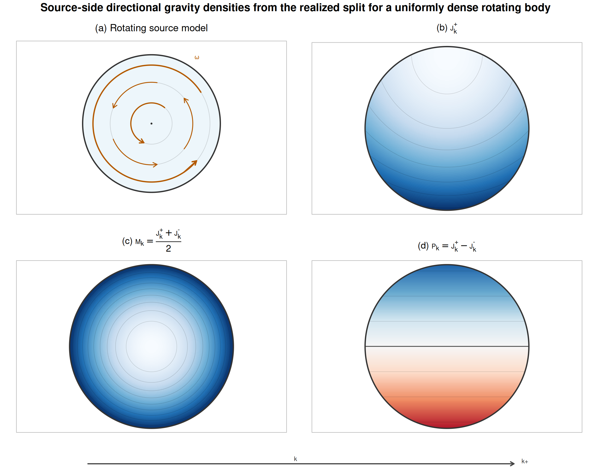

# Gravitational Sources

The source layer begins with momentum content.

In M1, gravity is not only sensitive to how much source content is present, but also to how that content is organized. A static compact source and a rotating source do not have the same gravitational role. The first is dominated by additive content. The second also carries directional organization.

That distinction matters because gravity has two visible kinds of stationary response. There is a depth-like response, read through clocking and scalar-well behavior. There is also a directional response, read through transport, rotation, and frame-drag-like behavior. M1 therefore does not ask one undifferentiated source quantity to carry every gravitational role at once. It begins with a source split.

## Directional source channels

For a chosen direction $k$, the basic gravitational source channels are local source-density fields,

$$
J_k^+(x),
\qquad
J_k^-(x).
$$

They represent positive source content associated with the two senses of direction $k$ at position $x$. In the stationary gravity normalization used here, $J_k^\pm$ are local source-density channels with units of kg/(s m$^2$). They are not integrated source amounts. They describe how much momentum-source content is locally presented per area and per time in each directional sense.

These channels are the source-side form of the directional-positive logic used in Foundations. Instead of beginning from a signed directional source alone, M1 begins from two positive directional channels and then forms the combinations needed for gravity.

The even or additive source package is

$$
M_k(x) = \frac{J_k^+(x) + J_k^-(x)}{2}.
$$

The odd or directional source package is

$$
P_k(x) = J_k^+(x) - J_k^-(x).
$$

Equivalently,

$$
J_k^\pm(x) = M_k(x) \pm \tfrac{1}{2}P_k(x).
$$

The quantity $M_k$ measures the part of the source that remains when directional sign is forgotten. It is the source role that feeds the scalar-well side of the field. The quantity $P_k$ measures directional imbalance. It is the source role that feeds the shift, rotation, and frame-drag-like side of the field.

This is the main conceptual lock of the source chapter. The later scalar and shift sectors are not arbitrary pieces of notation. They descend from a source split already present in the momentum bookkeeping.

The subscript $k$ labels the chosen direction used in this source split. It should not be confused with the core momentum $M$ introduced in Foundations. Here $M_k$ is a source package, not a component of a particle's core momentum.

{#fig-gravity-source-density-map fig-align="center"}

@fig-gravity-source-density-map shows the split visually. The point is not a full microscopic source law. The point is that the source has an even channel and an odd channel before the field variables are introduced.

## Stationary source consistency

A stationary source is not merely a source frozen at one moment. It is a source whose gravitational content can support a time-independent field description.

In M1 terms, the even package must supply a stable scalar-well source, and the odd package must supply a stable directional source for the shift sector.

This condition says that the directional source content must be prepared so that the stationary field problem is well posed. The detailed comparison with classical transverse-current language is collected later in the stationary correspondence chapter.

## Two source pictures

Two simple source pictures are enough for the mainline route.

The first is a static compact source. Its directional imbalance is absent or negligible at leading order. The even channel dominates, so the later field is led by the scalar well. This is the clean route to the Newtonian and static-spherical limit.

The second is a stationary rotating source. Its even content still builds the scalar well, but its directional content no longer cancels. The odd channel becomes visible, and the field acquires shift or frame-drag-like structure. This is the route by which stationary rotation enters the gravity program.

These examples are deliberately modest. They are not a full catalog of possible sources. They show the two source roles Part III needs before the stationary field is constructed.

## What the source layer establishes

The source layer establishes a limited but essential result. It packages gravitationally relevant momentum content before the field is built: directional-positive source-density channels are split into even and odd roles, and those roles prepare the scalar-well and shift sides of the stationary field system.

Once this is in place, the next chapter can ask the field question directly: given the even and odd source packages, what stationary deformation do they produce, and how is that deformation represented by scalar-well and shift variables? The later correspondence chapter then checks how these source roles face ordinary density and current language.
