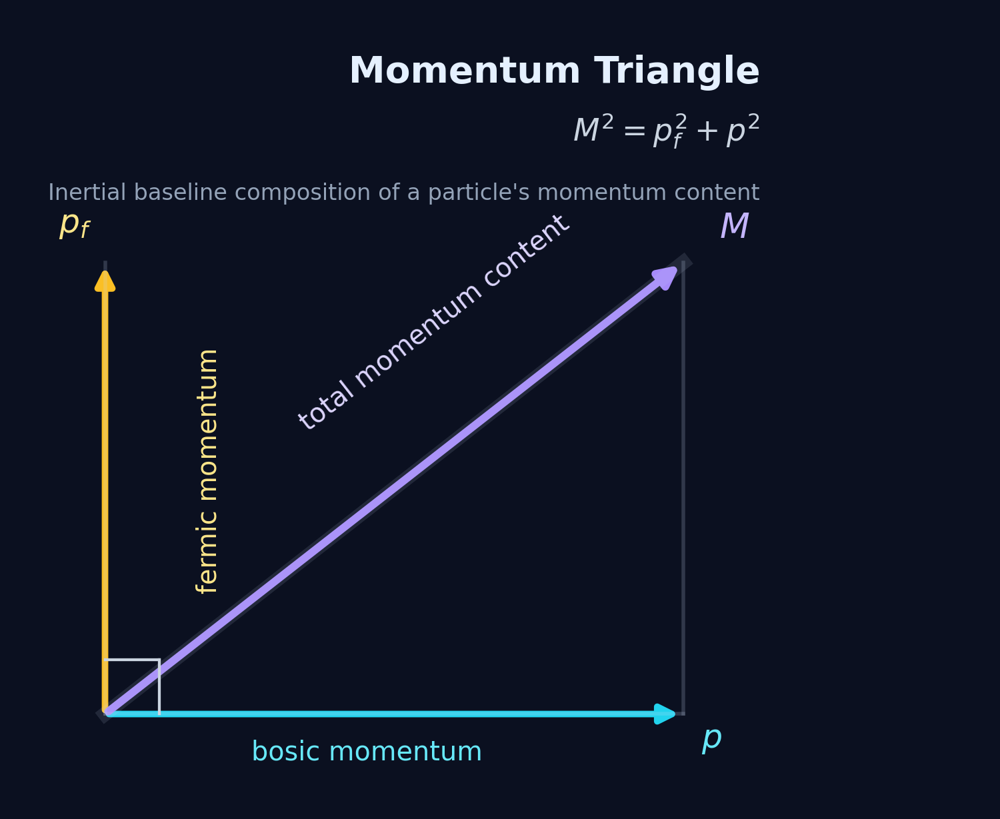
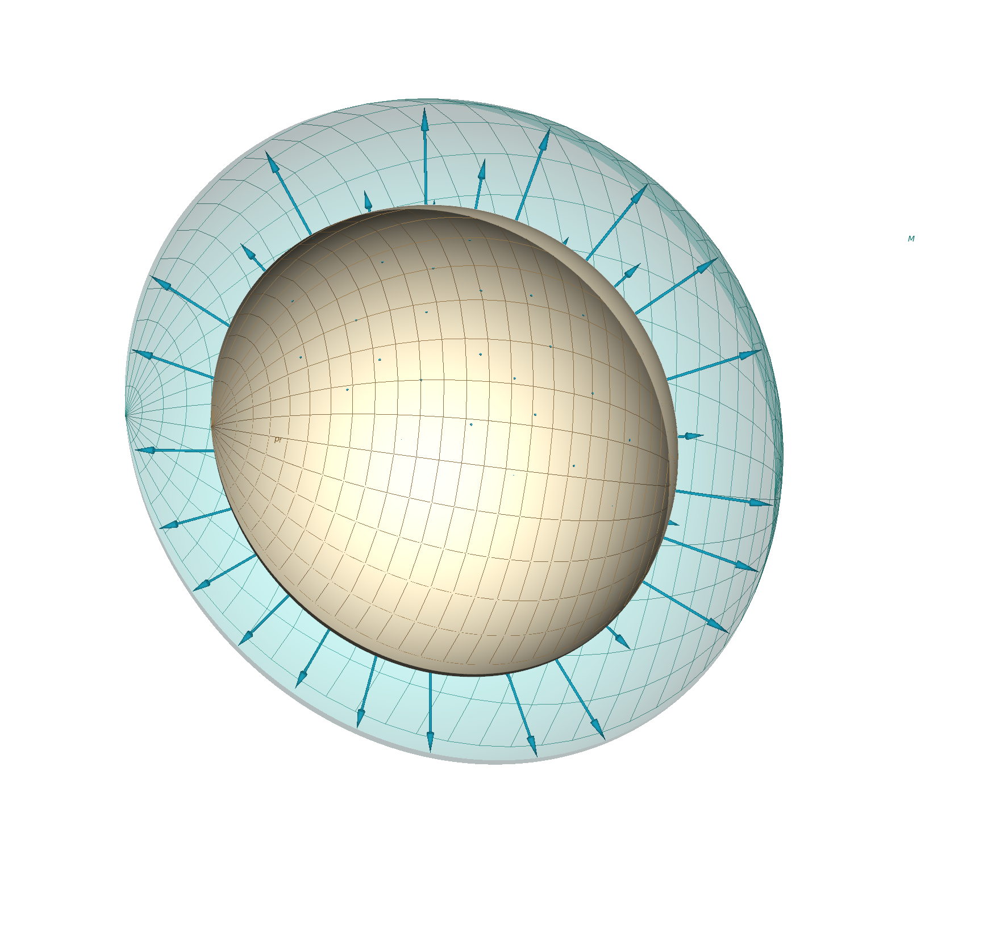
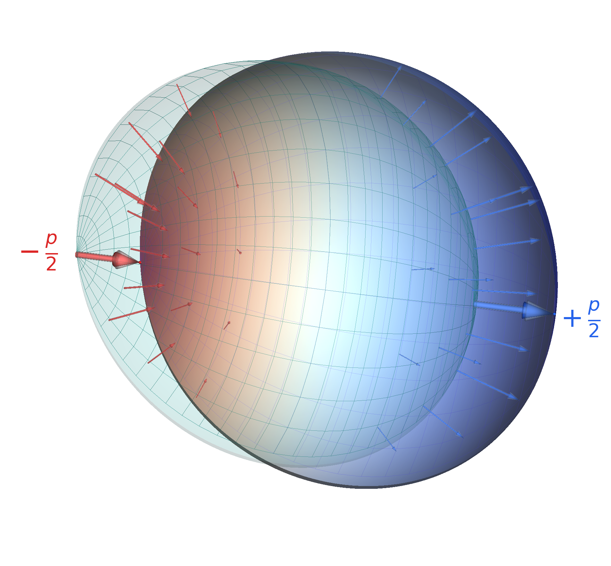

## The Momentum Configuration

A particle can translate only because it already has an organized internal momentum structure. M1 begins with that structure and distinguishes two perpendicular geometrical aspects within it: fermionic structure, which carries the particle's intrinsic organization, and bosonic geometry, on which translational momentum is expressed. Fermic and bosic momentum name the corresponding momentum roles.

### Fermionic structure and fermic momentum

A stable particle contains a closed fermionic momentum cycle. This is the persistent structure through which the particle retains its identity while its state of motion changes. Fermic momentum, written $p_f$, is the momentum locked into that cycle. It supplies the particle's intrinsic symmetric momentum scale,

$$
p_f=m_0c.
$$

The relation ties fermic momentum directly to rest mass: $m_0$ is the mass reading of momentum confined in the fermionic cycle. Other intrinsic properties, including charge, belong to the organization of that structure rather than to translational motion. Charge is not determined by the magnitude of $p_f$; it characterizes how the fermionic structure is organized. The detailed geometrical account of those identity properties lies beyond the present foundation.

With no translation, the fermic cycle has no preferred external direction. Its momentum organization is symmetric, and the particle's core momentum is entirely fermic.

### Perpendicular bosonic geometry

In flat space, the fermionic structure supports a bosonic geometry perpendicular to the fermionic cycle. Bosic momentum $p$ resides on this geometry. The word *perpendicular* describes the internal geometrical relation between the two momentum roles; it does not place $p_f$ along one ordinary spatial axis and $p$ along another.

The fermionic and bosonic aspects are therefore not separate particles or detachable layers. They are perpendicular aspects of one internal particle cycle. The fermionic aspect carries the locked intrinsic scale. The bosonic aspect provides the geometry on which momentum can acquire translational expression. Together these aspects form the spherical internal particle cycle referred to throughout this chapter.

The whole configuration is measured by its core momentum $M$. In the flat inertial baseline, M1 takes the total core momentum to follow the composition rule

$$
M=\sqrt{p_f^2+p^2}.
$$

The perpendicular geometry gives this rule its **momentum-triangle** interpretation. Fermic momentum and bosic momentum form perpendicular contributions to one momentum configuration and together determine its total core momentum.

{#fig-momentum-triangle fig-align="center" out-width="62%"}

### Swelling, asymmetry, and translation

When a particle gains bosic momentum, the whole momentum configuration swells from the fermic scale $p_f$ to the core scale $M$. The swelling is the spherical contribution of $p$ to the combined cycle. It does not yet select a direction: a larger symmetric shell alone would contain no information about which way the particle translates.

Translation appears because the bosonic structure also carries an asymmetry. Its organization over the spherical cycle is no longer directionally balanced. The shell represents that asymmetry by extending one side relative to $M$ while contracting the opposite side, producing a net direction. Bosic momentum yields translation through this asymmetry. It is therefore neither an external straight-line component nor a quantity detached from the particle's internal cycle: its spherical contribution swells the configuration, and its directional imbalance gives that momentum translational expression.

The swelling and asymmetry belong to one changed momentum configuration. They are not successive physical mechanisms. @fig-foundations-shells-admc separates them only so that each can be seen. Panel (a) compares the symmetric fermic scale $p_f$ with the swollen core scale $M$. Panel (b) keeps the spherical core shell $M$ visible as a reference while encoding the bosic asymmetry over the same structure. Along the net asymmetry direction, one side is displaced outward from $M$ by $p/2$, while the opposite side is displaced inward by $p/2$, giving the complete readings $M+p/2$ and $M-p/2$. The deformation represents their organization, not a measured spatial distribution of momentum density. The local arrows describe the deformation across the spherical cycle; they do not represent momentum leaving the particle or flowing along external straight lines.

::: {#fig-foundations-shells-admc layout-ncol=2}

{#fig-foundations-shells-admc-a}

{#fig-foundations-shells-admc-b}

Two three-dimensional views of one internal momentum configuration. Panel (a) shows the isotropic swelling from the fermic scale $p_f$ to the core scale $M$. Panel (b) shows the directional deformation carried by bosic momentum $p$ on that swollen spherical cycle. The panels separate two simultaneous features for explanation; they do not describe successive physical stages.
:::

The limiting configurations make the roles clear. When no momentum is expressed as translation,

$$
p=0,
\qquad
M=p_f.
$$

The core momentum is then entirely fermic. At the purely bosic boundary of the inertial composition rule,

$$
p_f=0,
\qquad
M=p.
$$

The full structural realization of this boundary lies beyond the particle construction developed here. When both roles are present, $p_f>0$ and $p>0$, and the core momentum measures the complete configuration rather than either contribution alone.

### Choosing a direction

Core momentum $M$ belongs to the configuration as a whole and does not depend on which spatial direction is chosen. The bosic asymmetry has a net direction represented by the vector $\vec p$, with magnitude

$$
p=|\vec p|.
$$

For any chosen oriented unit direction $\hat{k}$, the signed component along that direction is

$$
p_k=\vec p\mathbin{\cdot}\hat{k}=p\cos\alpha,
$$

where $\alpha$ is the angle from $\hat{k}$ to $\vec p$. The component $p_k$ records the asymmetry relative to $\hat{k}$; it does not mean that bosic momentum exists only along a line through the particle. Reversing the orientation from $\hat{k}$ to $-\hat{k}$ leaves $M$ unchanged and reverses the sign of $p_k$.

Along the net asymmetry axis, the two opposed shell readings are

$$
p^\pm=M\pm\tfrac12p.
$$

For the chosen $k$-axis, the corresponding readings are

$$
p_k^\pm=M\pm\tfrac12p_k.
$$

@fig-directional-momentum-readings connects the ordinary vector projection to these readings on the directional shell.

![Vector decomposition and directional shell readings. Panel (a) separates bosic momentum magnitude $p=|\vec p|$, its represented vector $\vec p$, and the signed projection $p_k=\vec p\cdot\hat{k}=p\cos\alpha$. Panel (b) shows the net-axis readings $p^{\pm}=M\pm p/2$, the perpendicular reading $p^\perp=M$, and the chosen-axis readings $p_k^{\pm}=M\pm p_k/2$ on one directional shell. The dashed circle marks the undeformed core scale $M$; capped spokes are positive scalar readings, not additional momentum vectors.](../../../../figures/build/foundations/directional-momentum-readings.png){#fig-directional-momentum-readings fig-align="center" width="100%" fig-pos="H"}

Superscripts $+$ and $-$ label the two opposed shell readings; they are not arithmetic signs. The quantities $p^\pm$, $p_k^\pm$, $p_f$, $p$, and $M$ all denote nonnegative scalar momentum quantities. By contrast, $\vec p$ denotes the momentum vector and $p_k$ its signed component along $\hat{k}$.

$$
p_k^+=p_k^-=p^\perp=M.
$$

Replacing $\hat{k}$ by $-\hat{k}$ changes $p_k$ to $-p_k$ and exchanges the two readings. The pair $(p_k^+,p_k^-)$ therefore preserves both kinds of directional information: its common center records the positive core momentum, while its asymmetry records the signed component.

Positivity follows directly from the inertial composition rule. Since

$$
|p_k|\le p\le M,
$$

the smaller of the two readings satisfies

$$
\min\!\left(p_k^+,p_k^-\right)
=M-\tfrac12|p_k|
\ge\tfrac12M>0
$$

for every nonempty particle configuration.

The momentum configuration has now supplied the positive directional readings that M1 conserves. The next section states that conservation principle.
