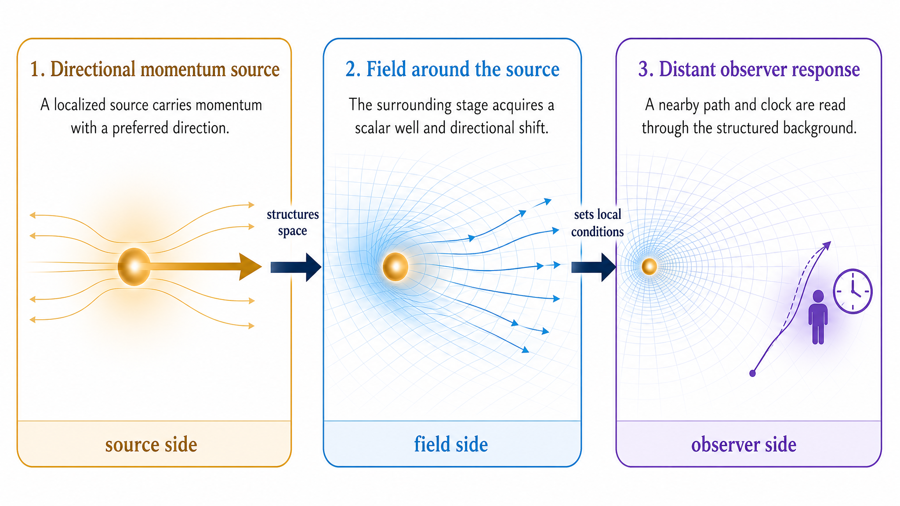

## Gravity in M1

Gravity first appears as altered physical behavior.

A clock placed near a massive body runs differently from a clock far away. A freely moving particle follows a path it would not follow in flat space. Light changes frequency as it moves between gravitational regions. These are the observer-facing signs of gravity: changed clocking, changed paths, and changed transport.

In M1, these effects are read through the momentum-first picture developed in the foundations. Momentum is the actor of physical change. Space is the stage on which that change is expressed. In flat space, the stage is treated as uniform: the same local relations are available everywhere. With gravity, that assumption fails.

The basic M1 picture is simple:

Momentum content places stress on space, deforming it. That deformation propagates to other locations where other particles then move, clock, and transport momentum according to the deformed space they inhabit.

This is the phenomenological core of M1 gravity.

A gravitational source is therefore not introduced first as a force acting at a distance. It is momentum content that changes the local spatial conditions around it. Those changed conditions extend outward from the source. A distant particle does not need to read the source directly. It responds to the local condition of space where it is.

This changes the way gravity is described. In an inertial setting, one can treat space as a fixed background and ask how momentum is expressed within it. In a gravitational setting, the background itself has a structure that changes with location and time. The question is no longer only how momentum moves through space, but how momentum changes the spatial conditions through which other momentum must move.

This is why gravity affects clocks as well as paths. A clock is a physical system with a stable internal cycle. If the local spatial condition changes how the clock's internal momentum structure is expressed, the clock rate changes. A freely moving body is also a momentum-bearing system. If the local spatial condition changes how its momentum is transported, its path changes.

The same idea applies to light. A photon moving through a gravitationally structured region is not merely passing through an empty background. Its momentum is transported through local conditions that can differ from place to place. The observed redshift or blueshift is then a readout of that changing gravitational condition.

{#fig-gravity-directional-source-field-observer fig-align="center" width="100%"}

@fig-gravity-directional-source-field-observer shows the basic route. Momentum content changes the local structure of space. The resulting deformation extends outward. Observer particles then read that altered condition through changed clocking, paths, and transport.

The important point in this opening chapter is not yet the detailed field equations. Those come later. The point is the physical order: momentum changes the relational/spatial conditions; local particles respond through changed clocking, paths, and transport.

This chapter develops this order step by step. The next section introduces the gravity-side vocabulary needed to make the picture precise: the source quantities, the field variables, and the local-readout quantities through which gravitational structure becomes observable kinematics.
