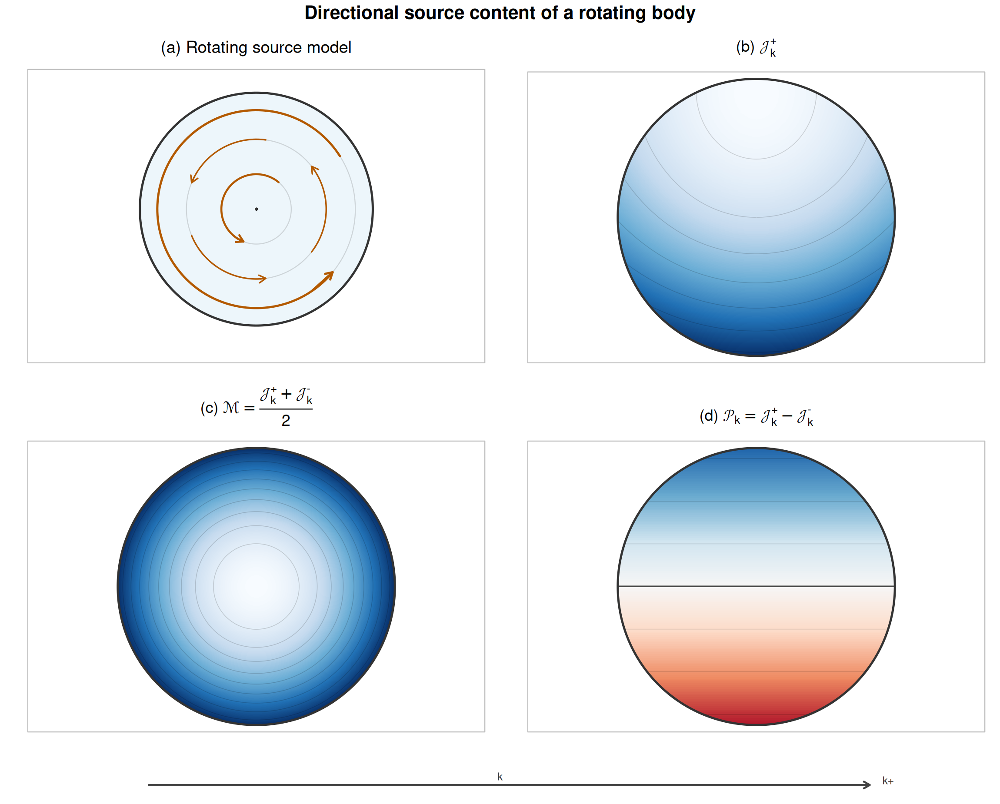

## Gravitational Sources

The source layer begins with momentum content.

In M1, gravity is not only sensitive to how much source content is present, but also to how that content is organized. A static compact source and a rotating source do not have the same gravitational role. The first is dominated by additive content. The second also carries directional organization.

That distinction matters because gravity has two visible kinds of stationary response. There is a depth-like response, read through clocking and scalar-well behavior. There is also a directional response, read through transport, rotation, and frame-drag-like behavior. M1 therefore does not ask one undifferentiated source quantity to carry every gravitational role at once. It begins with a source split.

### Directional source channels

For a chosen direction $k$, the basic gravitational source channels are local source-density fields,

$$
\mathcal{J}_k^+(x),
\qquad
\mathcal{J}_k^-(x).
$$

They represent positive source content associated with the two senses of direction $k$ at position $x$, with units of kg/(s m$^2$): momentum content per unit volume, sorted by directional sense. Concretely, $\mathcal{J}_k^+$ and $\mathcal{J}_k^-$ are the field image of the opposed shell readings $p_k^\pm=M\pm\tfrac{1}{2}p_k$ defined for a single carrier — the same positive readings, now accumulated as densities over the carriers present at $x$. Each channel is a positive directional total in its own right, never a signed component.

These channels are the source-side form of the shell-reading logic used in Foundations. Instead of beginning from a signed directional source alone, M1 begins with two positive directional channels and then forms the combinations needed for gravity.

The even or additive source package is

$$
\mathcal{M}_k(x) = \frac{\mathcal{J}_k^+(x) + \mathcal{J}_k^-(x)}{2}.
$$

The odd or directional source package is

$$
\mathcal{P}_k(x) = \mathcal{J}_k^+(x) - \mathcal{J}_k^-(x).
$$

Equivalently,

$$
\mathcal{J}_k^\pm(x) = \mathcal{M}_k(x) \pm \tfrac{1}{2}\mathcal{P}_k(x).
$$

The quantity $\mathcal{M}_k$ measures the part of the source that remains when directional sign is forgotten. It is the source role that feeds the scalar-well side of the field. The quantity $\mathcal{P}_k$ measures directional imbalance. It supplies the source role associated with shift, rotation, and frame-drag-like structure.

The calligraphic letters keep the source layer visually distinct from the particle layer: $\mathcal{M}_k$ is a source package, not the core momentum $M$ of a single carrier, and $\mathcal{P}_k$ is a source package, not a bosic momentum component $p_k$. That distinction is about to matter, because the two layers are related by the most direct map the framework could offer.

{#fig-gravity-source-density-map fig-align="center"}

@fig-gravity-source-density-map shows the split visually. The channels and their even/odd packages are the source language of the chapter. What remains is to say how physical momentum content fills them.

### From carrier readings to source channels

Foundations already defined the relevant quantities for a single carrier. For any oriented axis $\hat{k}$, a carrier with core momentum $M=\sqrt{p_f^2+p^2}$ and bosic component $p_k$ has the opposed shell readings

$$
p_k^+ = M + \tfrac{1}{2}p_k,
\qquad
p_k^- = M - \tfrac{1}{2}p_k .
$$

Both readings are positive, each contains the carrier's full core momentum, and the bosic component appears as a tilt between the two senses. ADMC conserves one shell reading for a selected orientation; reversing $\hat{k}$ exchanges $p_k^+$ and $p_k^-$.

Chapter 3 now makes a separate gravitational choice. The source identification SI postulates that a carrier feeds each axis's channel pair with its two readings:

$$
\boxed{
\mathcal{J}_k^\pm(x)
=
\left\langle\sum_a
\left(M_a\pm\frac{1}{2}p_{k,a}\right)
\right\rangle_x }.
$$

The brackets denote local coarse graining per unit volume. Nothing is added, rescaled, or reweighted in the displayed free-carrier map. SI is the source postulate of this chapter; it is not derived merely by defining the shell readings in Foundations.

Two field-facing consequences follow immediately.

First, the even package is the core-momentum density, on every axis. Forming $\mathcal{M}_k$ cancels the tilt identically:

$$
\mathcal{M}_k = \varrho
\qquad\text{for every }k,
\qquad
\varrho := \left\langle\sum_aM_a\right\rangle_x .
$$

The even source does not depend on the axis chosen to read it. The scalar well is direction-blind by algebra: whatever the carriers are doing, the $\pm\tfrac{1}{2}p_k$ tilt is precisely what the even combination removes. There is therefore one even source field, the local core-momentum density $\varrho$, and we write the well's source as $\mathcal{M}$ without an axis label. For free matter at rest, $\varrho$ is the fermic content $\rho c$ carried by the rest mass; for moving or hot free carriers it grows with their core momenta; for light it is the beam or bath content itself.

Second, the odd package is the net bosic component:

$$
\mathcal{P}_k = j_k ,
$$

the density of $p_k$ summed over carriers. Where opposite-directed carriers balance, the odd package vanishes; where they do not, their surplus remains. This current convention follows from SI rather than being selected later for correspondence.

A third package belongs to the fuller carrier-level accounting of momentum transport. Define

$$
\mathcal{C}_{ij}(x)
:=
\left\langle
\sum_a \frac{p_{i,a}p_{j,a}}{M_a}
\right\rangle_x.
$$

It records how momentum component $i$ is carried through spatial direction $j$. This makes $\mathcal{C}_{ij}$ the second transport moment of the same local momentum content, not a new source substance. It is needed for pressure, counterflow, shear, anisotropic dispersion, and radiation transport. The minimal stationary field map developed next uses only $\mathcal M$ and $\mathcal P_i$ as independent field inputs. Whether $\mathcal C_{ij}$ has an independent gravitational response remains an open completion question.

Finally, positivity is manifest. Since $|p_k|\le p\le M$ carrier by carrier,

$$
M\pm\frac{1}{2}p_k\ge\frac{1}{2}M\ge0,
$$

so every $\mathcal J_k^\pm$ is nonnegative. Given SI, axis independence, $\mathcal P_k=j_k$, and channel positivity are exact for the displayed free-carrier ledger.

### From carriers to continuous sources

The carrier map is stated per carrier; sources are continuous fields. The bridge is ordinary coarse-graining: over a mesoscale region around $x$, the channels accumulate the shell readings of every carrier present,

$$
\mathcal{J}_k^\pm(x)
=
\Bigl\langle \textstyle\sum_a \bigl(M_a \pm \tfrac{1}{2}p_{k,a}\bigr) \Bigr\rangle_x .
$$

For statistically described matter the same statement reads through the carrier distribution: the even source is the distribution's core-momentum content, the odd source its first bosic moment.

The same coarse-graining also defines $\mathcal{C}_{ij}$. It does not change the scalar or directional source just identified; it completes the momentum-accounting description when internal transport cannot be represented by the zeroth and first moments alone.

Two free-carrier situations show the mechanics. In an isotropic gas, carriers move in all directions: every $p_k$ appears alongside its opposite, the odd package cancels, and the gas sources through $\varrho$ while agitation appears in its core momenta and second transport moment. In a rotating carrier distribution, the bosic components are organized rather than random: ring by ring, $\mathcal{P}_\phi(r)$ survives and supplies a directional source that a static distribution of the same content does not.

The free-carrier result does not yet settle composite matter. Binding energy, interaction momentum, mediator content, wall tension, and improvements must all be localized in one conserved M1 ledger. No present interaction action derives that allocation. Claims about stressed solids, confining walls, or bound static fields must therefore wait for that construction.

The source postulate is stated and its exact free-carrier consequences are derived in [Appendix 3.3A](#sec-derivation-03-03A-carrier-source-map); the rejected null-probe route and the status-aware source dictionary are collected in [Appendix 3.3B](#sec-derivation-03-03B-null-probe-diagnostic) and [Appendix 3.3C](#sec-derivation-03-03C-momentum-manifestations).

### What different free sources present

Applied within its declared regime, SI gives a short dictionary:

| Manifestation | Even source $\mathcal M$ | Odd source $\mathcal P_i$ | Second moment $\mathcal C_{ij}$ |
|---|---|---|---|
| Cold free carriers at rest | $\rho c$ | $0$ | negligible in the ideal limit |
| Coherent dust stream | carrier content density | net momentum density $j_i$ | coherent transport |
| Isotropic free gas | content including agitation | $0$ | isotropic pressure moment |
| Isotropic null gas | $u/c$ | $0$ | isotropic radiation transport |
| Directed null beam | $u/c$ | beam current | directed null transport |
| Rotating carrier distribution | content density | azimuthal current | internal transport |

For a beam along $+x$,

$$
\mathcal J_x^+=\frac{3}{2}\frac{u}{c},
\qquad
\mathcal J_x^-=\frac{1}{2}\frac{u}{c},
\qquad
\mathcal P_x=\frac{u}{c}.
$$

The beam is directional without becoming exactly chiral in the shell channels. This distinguishes the affine carrier readings from quadratic null-flux probes, which are useful diagnostics but not the source identification used here.

### Stationary source consistency

A stationary source is not merely a source frozen at one moment. It is a source whose gravitational content can support a time-independent field description.

In M1 terms, the even package must supply a stable scalar-well source, and the odd package must supply a stationary-admissible directional source. The detailed transverse restriction belongs to the field construction rather than to SI itself.

### Two source pictures

Two simple source pictures are enough for the mainline route.

The first is a static compact source. Its directional imbalance is absent or negligible at leading order. The even channel dominates, so the later field is led by the scalar well. This is the clean route to the Newtonian and static-spherical limit.

The second is a stationary rotating source. Its even content still builds the scalar well, but its directional content no longer cancels. The odd channel becomes visible and supplies the source for a shift or frame-drag-like response. This is the route by which stationary rotation enters the gravity program, although the physical directional response remains provisional.

These examples are deliberately modest. They show the two source roles needed before the stationary field is constructed.

### What the source layer establishes

The source layer establishes a selected carrier map and its immediate consequences. SI identifies $\mathcal J_k^\pm$ with the local densities of $M\pm\tfrac{1}{2}p_k$. Given that postulate, the displayed free-carrier ledger yields one direction-blind well source $\mathcal M=\varrho$, one net directional source $\mathcal P_k=j_k$, and positive channels carrier by carrier.

The fuller momentum-accounting layer also contains $\mathcal C_{ij}$, the second transport moment. Its role is not to introduce another source substance. The symbols $\mathcal M$, $\mathcal P_i$, and $\mathcal C_{ij}$ are packages or moments of how momentum content is locally organized. Their interacting allocation and any independent gravitational response to $\mathcal C_{ij}$ remain open.

Once this is in place, the next section can ask the field question directly: given the even source package, what stationary scalar deformation does it produce, and what separate directional response is provisionally associated with the odd package?
